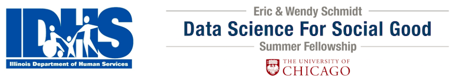
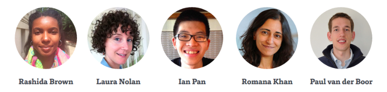

# Predicting and Reducing Adverse Births



The Illinois Department of Human Services (IDHS) operates the Better Birth Outcomes (BBO) initiative as an intensive case management program for at-risk pregnant women. BBO provides prenatal health education, coordination of care with primary and specialty medical services, referrals to childbirth education and parenting classes, access to contraceptive services, and overall care coordination. The goals of BBO program are as follows:

1. decrease the incidence of infant mortality and morbidity resulting from lack of adequate prenatal care;

2. improve pregnancy outcomes; 

3. reduce the incidence of prematurity and low birth weight.

BBO operates in targeted communities across Illinois that had high rates of preterm births in 2009. Women are determined to be eligible for the program using an evidence-based 17-item assessment questionnaire. 

## Data

We use administrative data from our partner and the American Community Survey (2009-2014) to produce our deliverables, and US vital statistics (2013) for additional exploratory data analyses. More information on these data sources can be found in the following locations (as of 8/17/15):

<p>IDHS Cornerstone Database: http://www.dhs.state.il.us/OneNetLibrary/27896/documents/Cornerstone/Cstone_User_Manual.pdf<p>

<p>American Community Survey: https://www.census.gov/acs/www/about/why-we-ask-each-question/<p>

<p>Vital Statistics: http://www.cdc.gov/nchs/nvss.htm<p>

## The Outcome

We define an adverse birth as one of the following:

1. Preterm (< 37 weeks gestation), or

2. Low birthweight (< 2,500 grams), or

3. Neonatal/infant death, or

4. Neonatal intensive care unit stay

## Repo Organization

This repo includes the following `folders/`, `subfolders/`, python scripts (`.py`), ipython notebooks (`.ipynb`), and sql scripts (`.sql`):

1. `babysaver/` - machine learning pipeline module
2. `etl/` - extract-transform-load pipeline
3. `exploratory/` - exploratory data analyses
4. `geospatial/`- geocode scripts, maps, SQL cleaning, caseload allocation, notebooks
5. `images` - images for README
6. `notebooks` - ipython notebooks that run our pipeline on Cornerstone and Vital Statistics data
7. `webapp/` - code for Flask app

`config.csv` is an example of the data configuration file used to load in variables via functions in `babysaver`. This can be edited manually spreadsheet-style or generated from a dictionary. See `babysaver/features.py` or `notebooks/babysaver_example.ipynb` for more details. 

## Module Installation

The `babysaver` module can deployed in python as follows:

```python
   import sys
   babysaver_parent = # this is where I cloned the babies repo
   sys.path.insert(0, babysaver_parent)
   from babysaver import features
   from babysaver import models
   from babysaver import evaluation
 ```  

## Team



## License

The MIT License (MIT)

Copyright (c) 2015 Data Science for Social Good, Rashida Brown, Laura Nolan, Ian Pan, Romana Khan, Paul van der Boor

Permission is hereby granted, free of charge, to any person obtaining a copy of this software and associated documentation files (the "Software"), to deal in the Software without restriction, including without limitation the rights to use, copy, modify, merge, publish, distribute, sublicense, and/or sell copies of the Software, and to permit persons to whom the Software is furnished to do so, subject to the following conditions:

The above copyright notice and this permission notice shall be included in all copies or substantial portions of the Software.

THE SOFTWARE IS PROVIDED "AS IS", WITHOUT WARRANTY OF ANY KIND, EXPRESS OR IMPLIED, INCLUDING BUT NOT LIMITED TO THE WARRANTIES OF MERCHANTABILITY, FITNESS FOR A PARTICULAR PURPOSE AND NONINFRINGEMENT. IN NO EVENT SHALL THE AUTHORS OR COPYRIGHT HOLDERS BE LIABLE FOR ANY CLAIM, DAMAGES OR OTHER LIABILITY, WHETHER IN AN ACTION OF CONTRACT, TORT OR OTHERWISE, ARISING FROM, OUT OF OR IN CONNECTION WITH THE SOFTWARE OR THE USE OR OTHER DEALINGS IN THE SOFTWARE.
